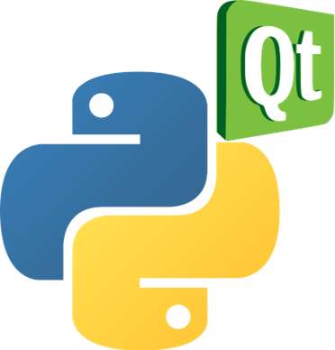

# Super-Resolution_GUI
Super resolution GUI Ver.

PyQt is tool for making gui for python.

I had done Super_Resolution Project 2 weeks ago. And I want to do make my project to gui project.

so i had done this.

The result is below.

